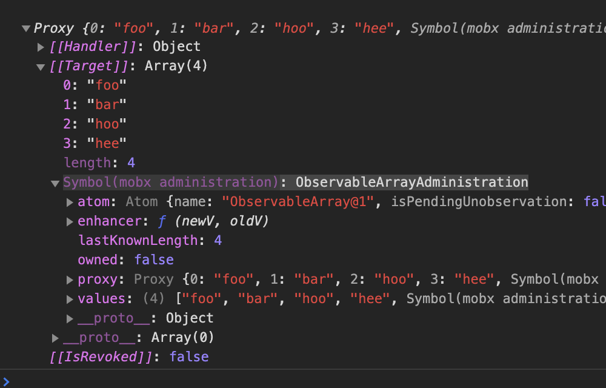

# Mobx Source Code Reading Note 1

## observable function

### Notice

To make this note more clear to get understood, noncritical codes in some functions may be truncated. Complete codes can be found via those hyperlinks.

### Demo

```ts
const originalArray = ["foo", "bar", "hoo", "hee"];
const observedArray = mobx.observable(originalArray);
console.log("originalArray", originalArray);
console.log("observedArray", observedArray);
```

mobx.observable is

[src/api/observable.ts#L203](https://github.com/mobxjs/mobx/blob/5.13.0/src/api/observable.ts#L203)

```ts
export const observable: IObservableFactory &
  IObservableFactories & {
    enhancer: IEnhancer<any>;
  } = createObservable as any;
```

[src/api/observable.ts#L80](https://github.com/mobxjs/mobx/blob/5.13.0/src/api/observable.ts#L80)

```ts
function createObservable(v: any, arg2?: any, arg3?: any) {
  // v is originialArray and would be passed to observable.array(v, arg2)
  const res = isPlainObject(v)
    ? observable.object(v, arg2, arg3)
    : Array.isArray(v)
    ? observable.array(v, arg2)
    : isES6Map(v)
    ? observable.map(v, arg2)
    : isES6Set(v)
    ? observable.set(v, arg2)
    : v;

  // this value could be converted to a new observable data structure, return it
  if (res !== v) return res;
}
```

`observable.array` is from
[src/api/observable.ts#L209](https://github.com/mobxjs/mobx/blob/5.13.0/src/api/observable.ts#L209)

```ts
Object.keys(observableFactories).forEach(
  name => (observable[name] = observableFactories[name])
);
```

[src/api/observable.ts#L153](https://github.com/mobxjs/mobx/blob/5.13.0/src/api/observable.ts#L153)

```ts
const observableFactories: IObservableFactories = {
  array<T = any>(
    initialValues?: T[],
    options?: CreateObservableOptions
  ): IObservableArray<T> {
    if (arguments.length > 2) incorrectlyUsedAsDecorator("array");
    const o = asCreateObservableOptions(options);
    return createObservableArray(
      initialValues,
      getEnhancerFromOptions(o),
      o.name
    ) as any;
  }
};
```

Codes of `asCreateObservableOptions` and `getEnhancerFromOptions` function are omitted, just remember the value of `o` is

```ts
export const defaultCreateObservableOptions: CreateObservableOptions = {
  deep: true,
  name: undefined,
  defaultDecorator: undefined,
  proxy: true
};
```

Get paramaters listed down before we see `createObservableArray`:

1.  `initialValues` is the original array from
    ```ts
    const originalArray = ["foo", "bar", "hoo", "hee"];
    ```
2.  `getEnhancerFromOptions(o)` is

    ```ts
    export function deepEnhancer(v, \_, name) {
    // it is an observable already, done
    if (isObservable(v)) return v

        // something that can be converted and mutated?
        if (Array.isArray(v)) return observable.array(v, { name })
        if (isPlainObject(v)) return observable.object(v, undefined, { name })
        if (isES6Map(v)) return observable.map(v, { name })
        if (isES6Set(v)) return observable.set(v, { name })

        return v

    }
    ```

3.  `o.name` is `undefined`

[src/types/observablearray.ts#L117](https://github.com/mobxjs/mobx/blob/5.13.0/src/types/observablearray.ts#L117)

```ts
export function createObservableArray<T>(
  initialValues: any[] | undefined,
  enhancer: IEnhancer<T>,
  name = "ObservableArray@" + getNextId(),
  owned = false
): IObservableArray<T> {
  const adm = new ObservableArrayAdministration(name, enhancer, owned);
  addHiddenFinalProp(adm.values, $mobx, adm);
  const proxy = new Proxy(adm.values, arrayTraps) as any;
  adm.proxy = proxy;
  if (initialValues && initialValues.length) {
    const prev = allowStateChangesStart(true);
    adm.spliceWithArray(0, 0, initialValues);
    allowStateChangesEnd(prev);
  }
  return proxy;
}
```

See `ObservableArrayAdministration` first

[src/types/observablearray.ts#L135](https://github.com/mobxjs/mobx/blob/5.13.0/src/types/observablearray.ts#L135)

```ts
class ObservableArrayAdministration
  implements
    IInterceptable<IArrayWillChange<any> | IArrayWillSplice<any>>,
    IListenable {
  atom: IAtom;
  values: any[] = [];
  enhancer: (newV: any, oldV: any | undefined) => any;
  proxy: any[] = undefined as any;

  constructor(name, enhancer: IEnhancer<any>, public owned: boolean) {
    this.atom = new Atom(name || "ObservableArray@" + getNextId());
    this.enhancer = (newV, oldV) => enhancer(newV, oldV, name + "[..]");
  }
}
```

1. The constuctor of `Atom` initialized a instance with an unique name
2. `this.enhancer` looks like a function to make new assigned value to be observable

And this `adm` was assigned to `adm.values[$mobx]` using `addHiddenFinalProp`, where `$mobx` is `Symbol("mobx administration")`, which is exactly this one


Then `const proxy = new Proxy(adm.values, arrayTraps) as any`, where `arrayTraps` is an interceptor that only intercepts but doesn't change the target's original behaviors

```ts
const arrayTraps = {
  get(target, name) {
    if (name === $mobx) return target[$mobx];
    if (name === "length") return target[$mobx].getArrayLength();
    if (typeof name === "number") {
      return arrayExtensions.get.call(target, name);
    }
    if (typeof name === "string" && !isNaN(name as any)) {
      return arrayExtensions.get.call(target, parseInt(name));
    }
    if (arrayExtensions.hasOwnProperty(name)) {
      return arrayExtensions[name];
    }
    return target[name];
  },
  set(target, name, value): boolean {
    if (name === "length") {
      target[$mobx].setArrayLength(value);
    }
    if (typeof name === "number") {
      arrayExtensions.set.call(target, name, value);
    }
    if (typeof name === "symbol" || isNaN(name)) {
      target[name] = value;
    } else {
      // numeric string
      arrayExtensions.set.call(target, parseInt(name), value);
    }
    return true;
  },
  preventExtensions(target) {
    fail(`Observable arrays cannot be frozen`);
    return false;
  }
};
```

Then `const prev = allowStateChangesStart(true)` allows the following changes to pass the check at [checkIfStateModificationsAreAllowed(this.atom)](https://github.com/mobxjs/mobx/blob/5.13.0/src/types/observablearray.ts#L210)

`adm.spliceWithArray(0, 0, initialValues)` assign `originalArray` to `adm.values`.

Notice that all elements inside `originalArray` would also get observed at

[src/types/observablearray.ts#L236](https://github.com/mobxjs/mobx/blob/5.13.0/src/types/observablearray.ts#L236)

```ts
newItems =
  newItems.length === 0
    ? newItems
    : newItems.map(v => this.enhancer(v, undefined));
```
